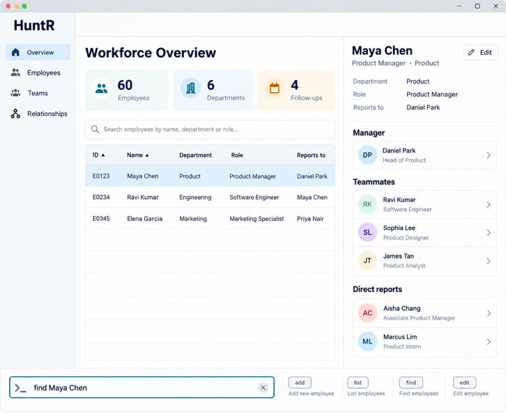

# HuntR

HuntR is a desktop app for the sole HR administrator at a small or medium-sized company. It helps them keep employee records accurate, see how staff relate to each other, such as who reports to whom and who works in which team, and get an overall picture of the workforce. It is optimised for administrators who prefer typing commands, while still showing results in a graphical interface.

For the detailed documentation of this project, see the **[HuntR Product Website](https://ay2627-cs2103t-w10-4.github.io/tp/)**.

For detailed documentation, see the **[HuntR Product Website](https://ay2627s1-cs2103t-w10-4.github.io/tp/)**.

## User interface

The UI mockup presents HuntR as a workforce management dashboard. The navigation bar on the left gives users quick access to the Overview, Employees, Teams, and Relationships pages. On the Overview page, summary cards show the total numbers of employees, departments, and follow-ups. Users can search for employees and scan key information such as employee ID, department, role, and reporting manager in the central table.

Selecting an employee displays their profile and reporting relationships in the panel on the right, including their manager, teammates, and direct reports. Users can also add, list, find, or edit employees through the command bar at the bottom; for example, they can type `find Maya Chen` and press <kbd>Enter</kbd>. This combination of visual navigation and keyboard commands helps users understand their workforce at a glance while completing common tasks efficiently.

## Planned features

The features below describe the intended employee-management functionality. Employee-specific fields and commands are still under development.

### Add employees

HuntR allows HR administrators to add employees to their workforce records using the `add` command. Each employee is assigned a unique employee ID and can have their name, phone number, email, department, and role recorded.

Example:
`add id/E0123 n/John Tan p/91234567 e/johntan@example.com d/Engineering r/Software Engineer`

### List employees

HuntR allows HR administrators to view all employees currently stored in the application using the `list` command. Each employee is displayed with their employee ID, name, phone number, email, department, and role.

Example:
`list`

### Delete employees

HuntR allows HR administrators to remove an employee from the workforce records using the employee's unique employee ID.

Example:
`delete id/E0123`

### Find employees

HuntR allows HR administrators to find employees whose names contain any of the given keywords using the `find` command. Matching is case-insensitive and matches full words only.

Example: `find John`

### Automatic data persistence

HuntR automatically saves your workforce records to disk after every change, and reloads them the next time the application is launched — no manual save or load required.

### Exit

HuntR allows HR administrators to close the application using the `exit` command, ensuring all workforce records are safely saved before the session ends.

Example: `exit`

## Acknowledgements

HuntR is based on the [AddressBook-Level3 (AB3)](https://github.com/se-edu/addressbook-level3) project created by the [SE-EDU initiative](https://se-education.org/).
