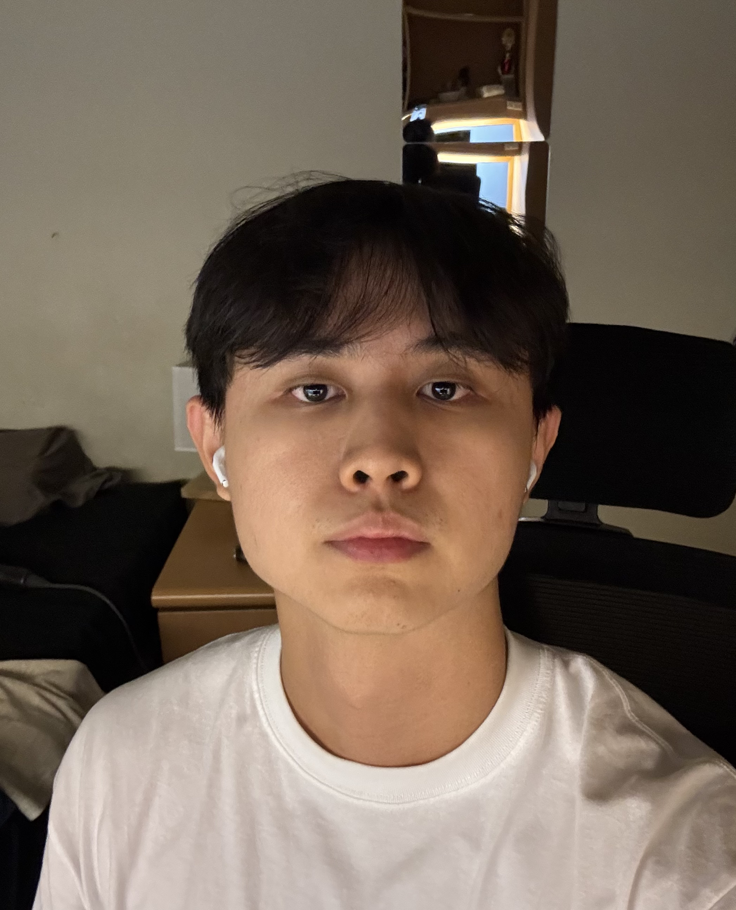
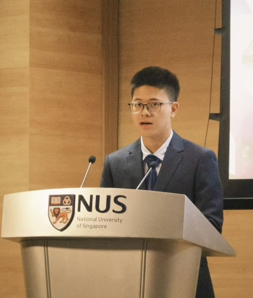
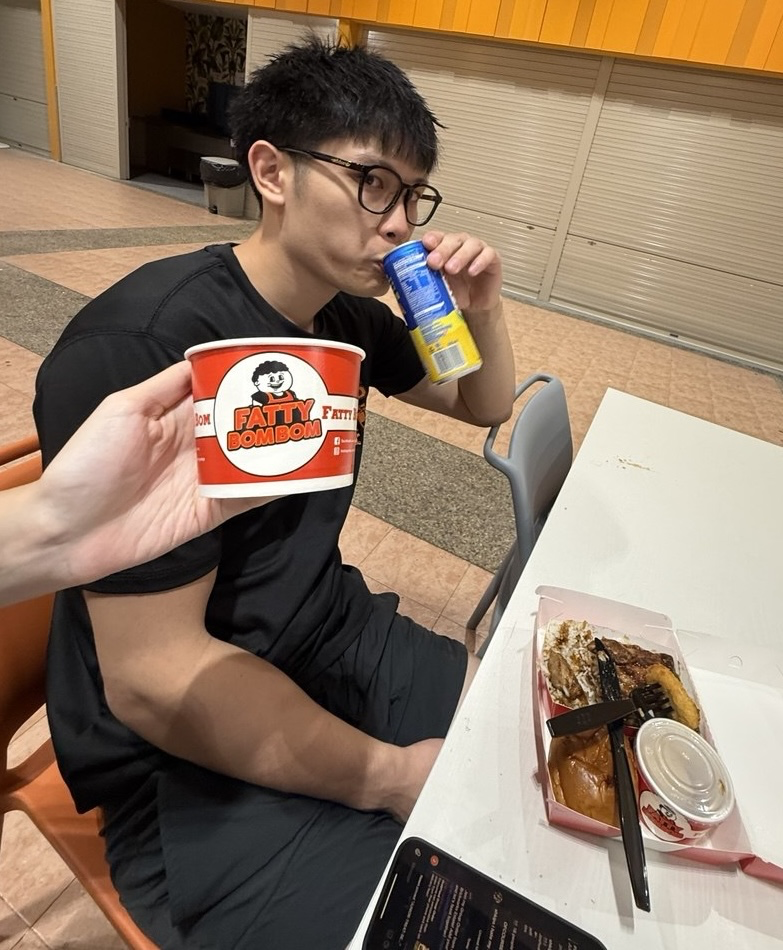
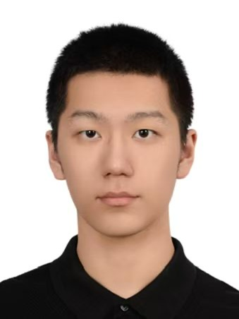
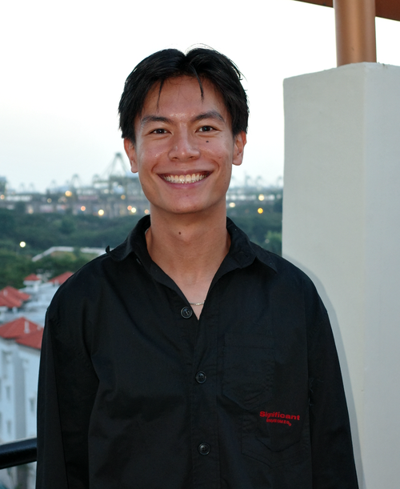

# About Us

We are a team based in the [School of Computing, National University of Singapore](http://www.comp.nus.edu.sg).

You can reach us at the email `seer[at]comp.nus.edu.sg`

## Project team

### Dylan Chew

[[github](https://github.com/cjldylan)]

* Role: Team Lead

### Zhang Hanzhong

[[github](http://github.com/ZhangHanzhongFox)]
[[portfolio](team/johndoe.md)]

* Role: Documentation
* Responsibilities: Responsible for the quality of various project documents.

### Joshua Sim

[[github](http://github.com/sjyjoshua)]
[[portfolio](team/sjyjoshua.md)]

* Role: Code Quality
* Responsibilities: Dev Ops + Threading

### Penglong

[[github](https://github.com/stephen-118)]

* Role: Testing
* Responsibilities: Ensures the testing of the project is done properly and on time

### Lee Wei Zhi

[[github](http://github.com/LEE-wz)]

* Role: Integration
* Responsibilities: In charge of versioning the code, maintaining the code repository, and integrating various parts of the software to create a whole.

### Han Yu Ding, Matthew

[[github](https://github.com/matthewhanyd)]

* Role: Scheduling and tracking, Deliverables and deadlines
* Responsibilities:
  * Deliverables and deadlines: Ensures project deliverables are done on time and in the right format.
  * Scheduling and tracking: In charge of defining, assigning, and tracking project tasks.
